## <div align="center"> 基于无信号交叉口的车辆行人数据分析软件 </div>

## <div align="center"> ⭐ 项目部署 </div>

在Pycharm中打开该项目，配置一个venv虚拟环境后，直接按下面命令安装依赖即可：
```bash
pip install -r requirements.txt
```

## <div align="center"> ⭐ 注意事项 </div>
- 本项目主要对交通数据集进行分析，并进行相应的图表可视化
- 数据集只是demo级别，方便展示，否则处理效率过低，程序容易卡死
- 最后一个深度学习demo参考了李沐老师的d2l视频，用的是`data`文件夹里面的`FashionMNIST`数据集

## <div align="center"> ⭐ 功能介绍 </div>
### 总体布局介绍  
#### 首页  
用户刚开始登录到本软件后，会直接呈现首页，其中包括视频展示区域以及交叉口相关运动对象轨迹呈现。
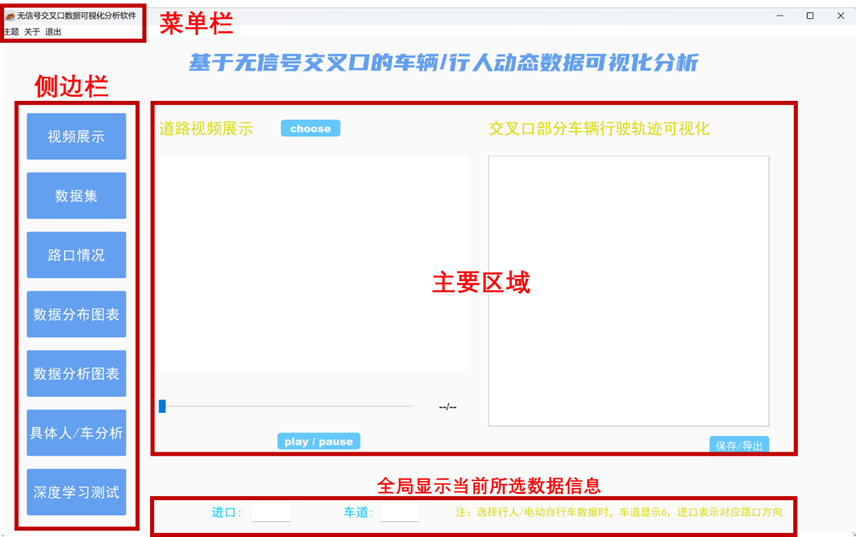


#### 菜单栏
在软件最左上角的区域，有菜单栏，用户可以选择主题、关于和退出三个功能。主题的下拉菜单里有5种软件主题色调供用户选择，点击不同按钮即可切换不同主题色。
以下是其中三种主题色切换效果图：

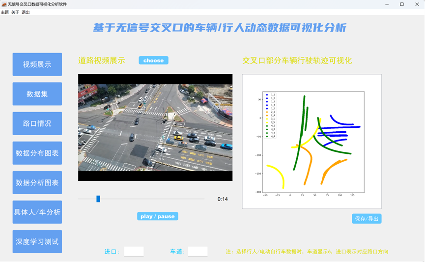
（默认色调）

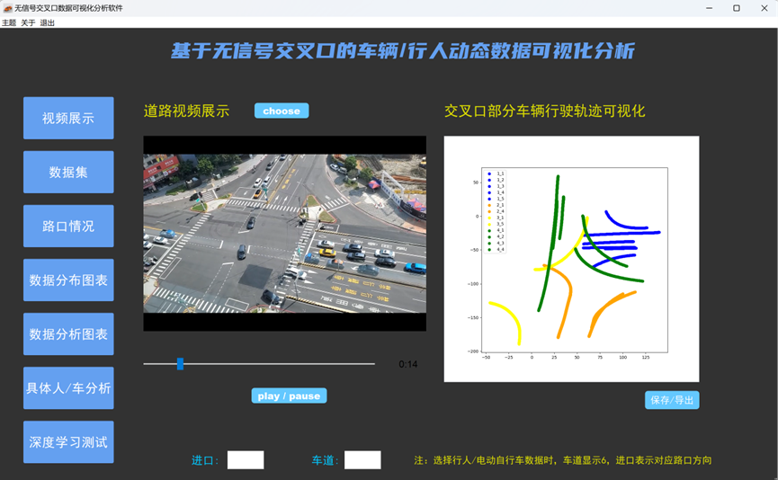
（黑色调）

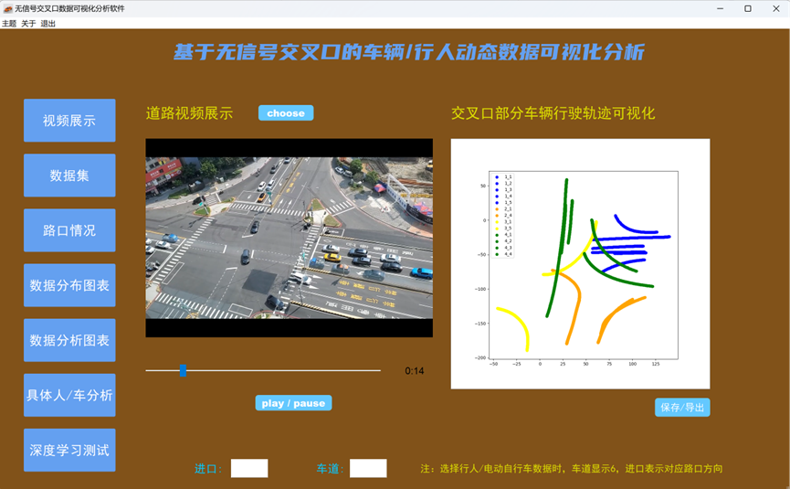
（棕色调）

“关于”按钮的下拉框中，可选intro来查看本软件的简要介绍，也可选择version来查看软件当前版本相关信息。
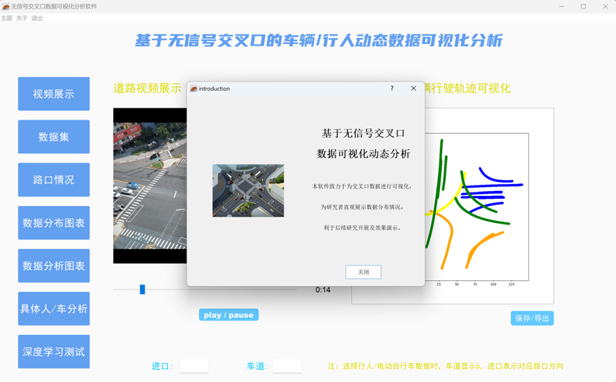
（intro软件介绍）


（version版本信息）

点击退出，在弹出的下拉框中点击exit即可退出本程序。
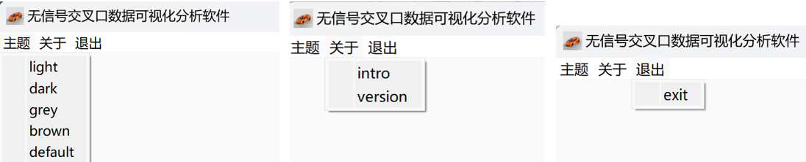
（菜单栏下拉框显示）


#### 侧边栏  
侧边栏有7个选项，点击可跳转到不同页面，用户刚登录时默认是第一个界面，也就是可以展示视频的首页。其他六个选项分别对应着数据导入，数据展示等功能。


### 视频和运动轨迹展示  
用户点击界面左上方的choose选择按钮后，会进入文件管理器，可以选择对应视频文件并打开，即可在下方区域播放视频，其中视频下方有展示进度条和播放剩余时间，用户可以拖动进度条改变视频当前进度，还可以点击play/pause按钮实现暂停和继续播放的功能。


### 数据导入  
点击侧边栏的第二个选项卡“数据集”，即可跳转到数据导入的功能页面。初始页面效果如下：
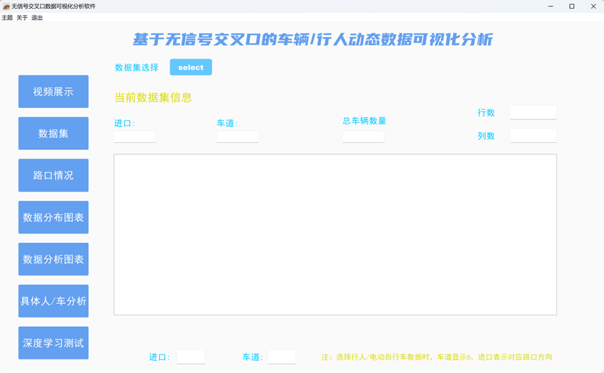

在该页面中，用户点击选择select按钮，即可进入到文件管理器中，选择想要导入的数据，数据须为excel表格（.xlsx .xls格式）或者csv数据（.csv格式）。选择后开始加载数据，并将加载好的数据显示到下面的表格中。同时在数据表周围，还会呈现该表的基本信息，包括车辆数，车道位置等等。具体展示效果如下：
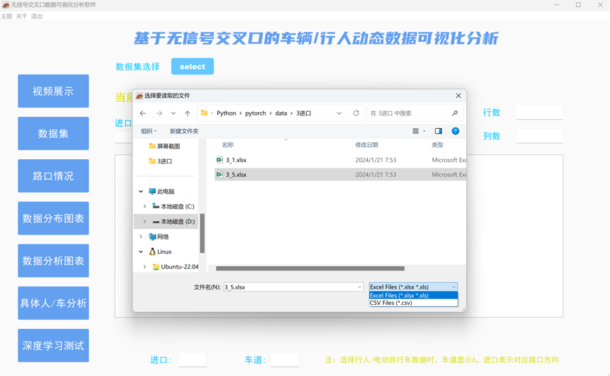
（选择文件页面）

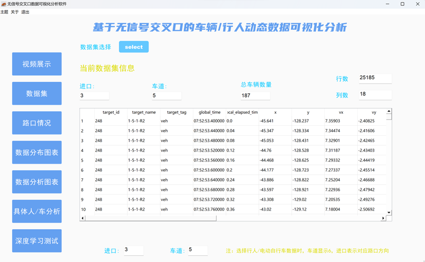
（数据集展示）

### 总体数据展示
点击侧边栏的第三个选项卡，可对整个交叉口的数据进行汇总处理，并以热力图、3D图的形式直观展示所有数据的分布，如下图所示：
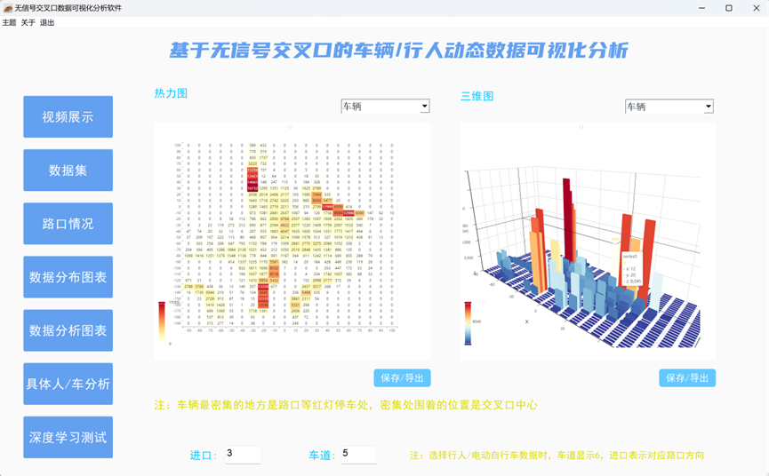
（所有车辆的数据分布图）

点击两个图表右上方的下拉框，还可以切换到行人/电动/自行车这一类的数据分布，以下是其展示效果图：
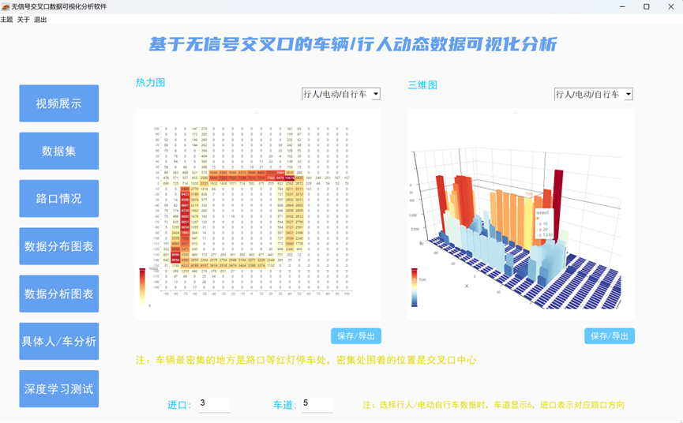
（所有行人/电动/自行车的数据分布图）


### 所选数据分布
点击侧边栏第四个选项卡，即可查看导入数据的相关信息。  
若用户没选择数据集便点击到该页面，则会有弹框提示用户未选择数据集，页面上的相关区域不会显示图表。
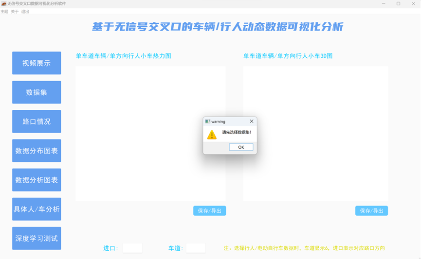
（弹框提示）

若用户选择了数据集，则该页面会显示出两个图表，分别展示该数据集的热力分布图和3D柱状图，用户可具体查看所选数据集的数据分布。
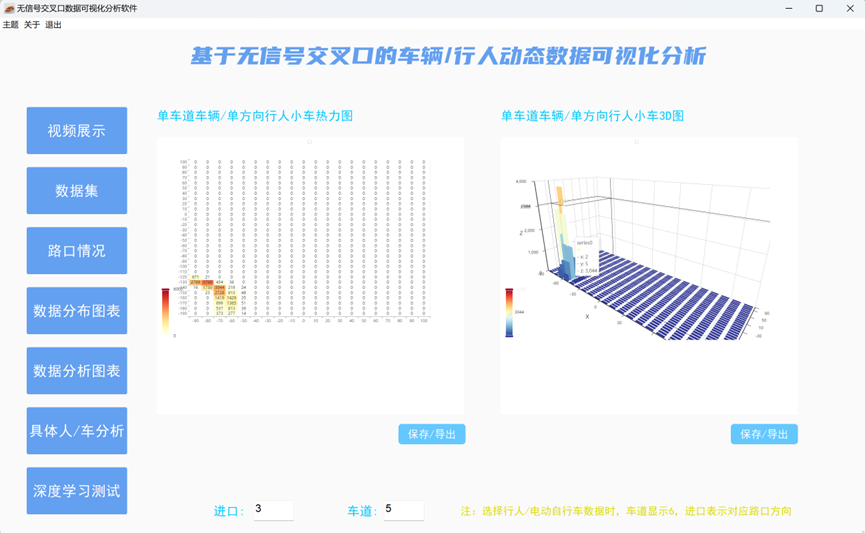
（选择车辆数据集的展示效果）
 
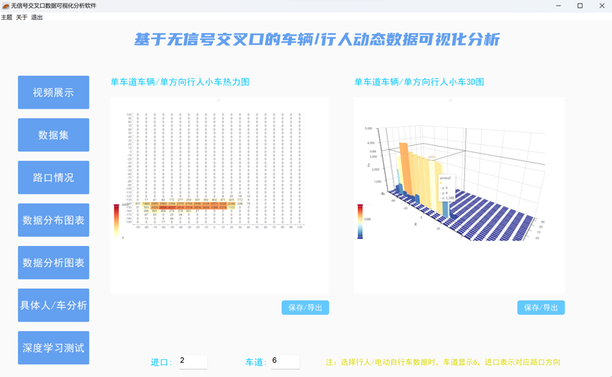
（选择行人/小车数据集的展示效果）


### 所选数据分析
和之前同理，若用户没选择数据集便点击到该页面，则会有弹框提示用户未选择数据集。页面上的相关区域不会显示图表。
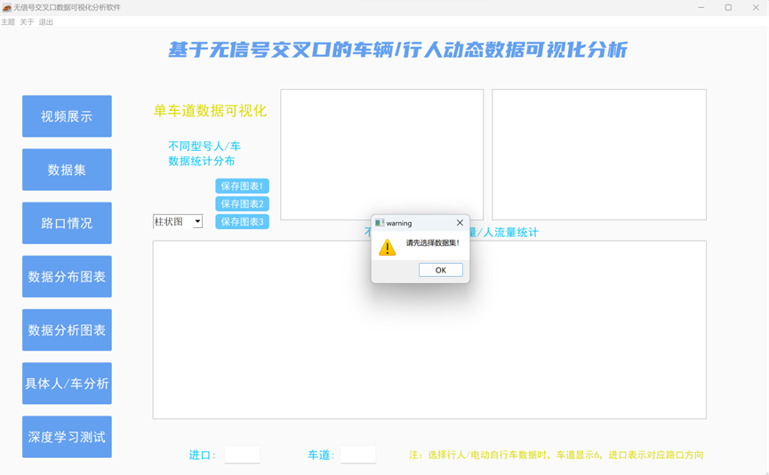

在第五个选项卡的图表中，分布展示着该数据集的多项数据图表，其中包括车辆类型统计，以及不同时段的车流量/人流量统计，以柱状图，折线图，饼状图多种图表方式来对数据分别进行可视化，从而直观表现出数据情况。
其中统计不同时段车/人流量有下拉框，其中三个选项可选择多种图表呈现形式，如下图：

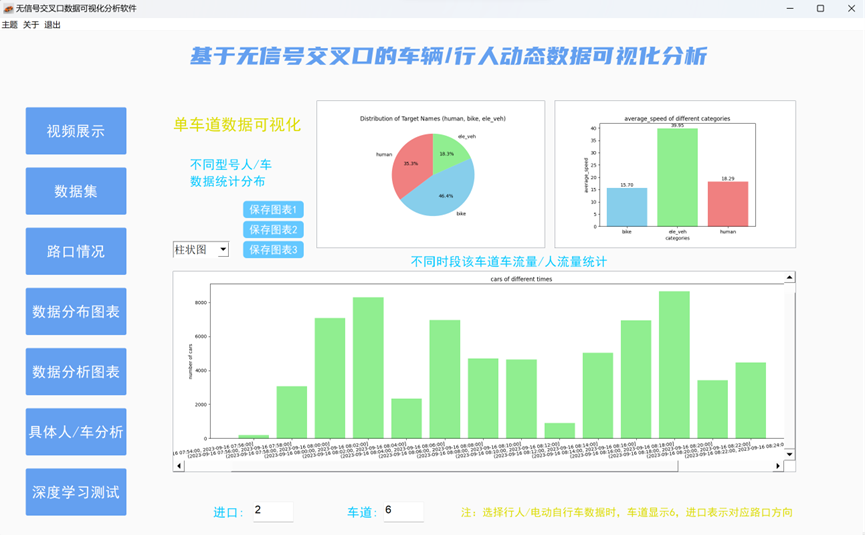
（柱状图展示）
 
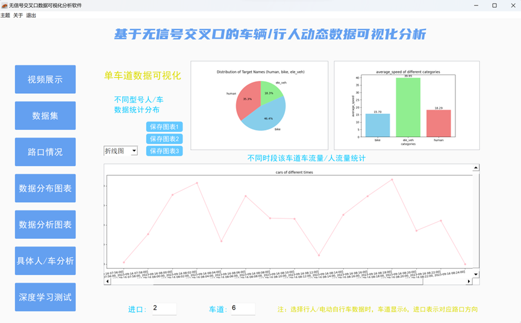
（折线图展示）
 
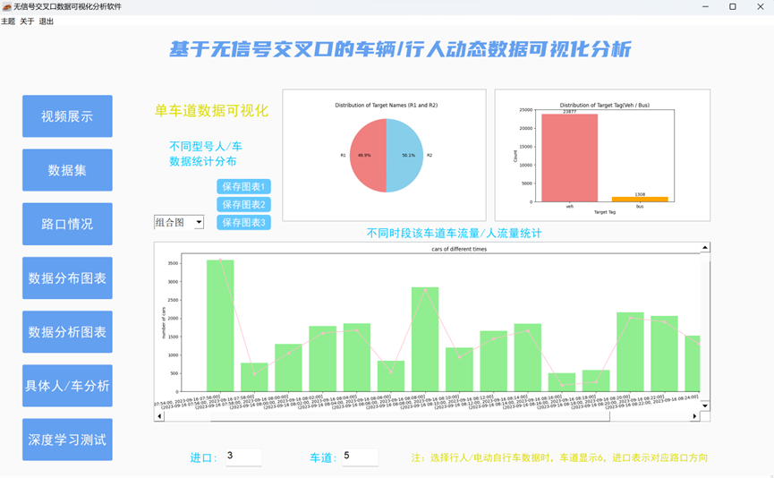
（组合图展示）


### 具体车辆/行人数据分析
在文本框中输入所需查询的对象id后，点击查询即可得到关于该对象的详细信息，如果在导入的数据表中查不到此id，会弹出提示框提示用户重新输入。如果此时还未加载数据集，则会弹出提示框提示用户未加载。

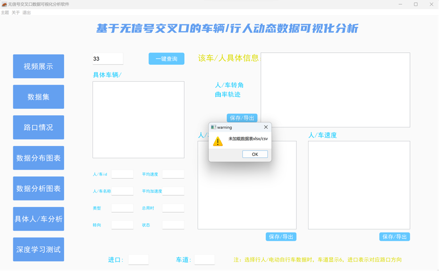
（未加载的提示框）

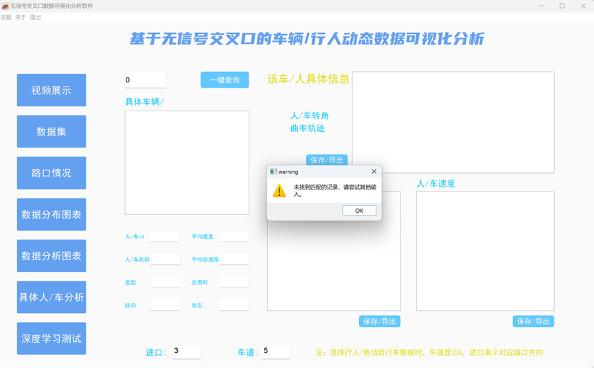 
（未找到记录的提示框）
	
如果查到后，会根据对象类型展示对应的模型图片，以及该对象的多种具体数值。对于该对象通过交叉口的全过程数据，可在右侧多种图表中进行呈现，其中包括行走曲率角度，速度、加速度分析以及全过程具体的位置移动路径。

以下是其中三种类型的数据页面展示：
 
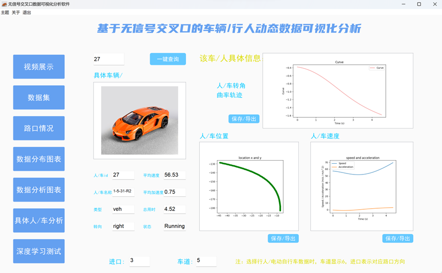
（汽车展示效果图）
 
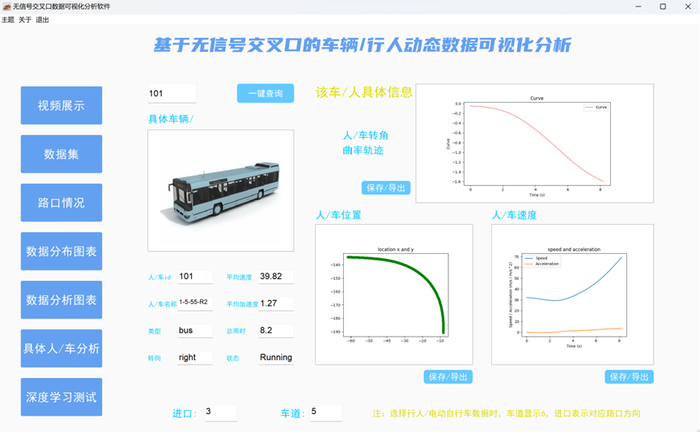
（公交车展示效果图）
 
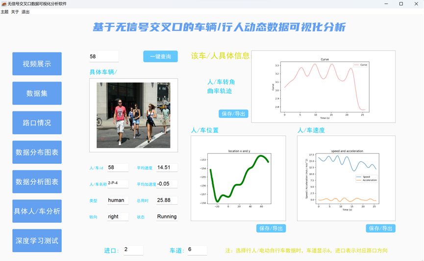
（行人展示效果图）


### 基于pytorch的深度学习数据测试
用户输入相关参数后点击训练模型，即可对相关交叉口数据进行训练，并在测试集上检测模型效果，通过折线图的形式展现出模型的收敛效果好坏。若用户输入参数不完整，则会弹出提示框提示用户输入不能为空。

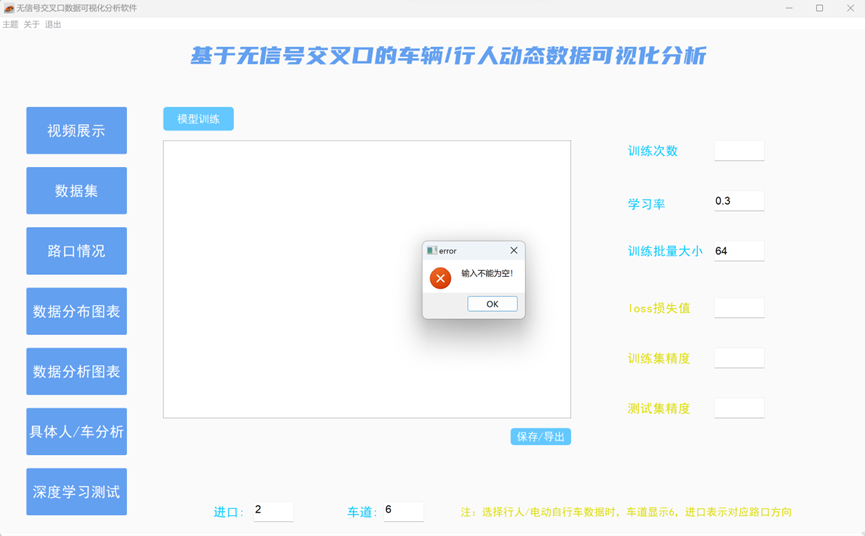
（输入信息不完整的弹框提示）

用户还可在右侧继续修改相关参数，包括总迭代次数，学习率，批量处理大小三个参数选项，对模型进行调参，以获得最佳的模型表现效果。左侧会显示历次迭代的数据变化图，可直观展现模型的迭代过程和效果，右侧还会显示最终对应的loss损失值，训练集和测试集上的具体训练精度值，呈现最终效果，作为衡量模型优良的指标。具体效果展示如下：
 
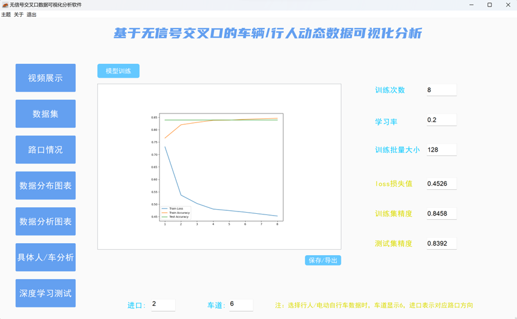
（训练完成时的展示效果）


### 图表导出为图片
在每个图表的周围，都有一个保存/导出按钮，可以将对应的图像进行重命名并保存导出为图片，利于用户存储记录一些包含关键数据的图表，效果展示如下：

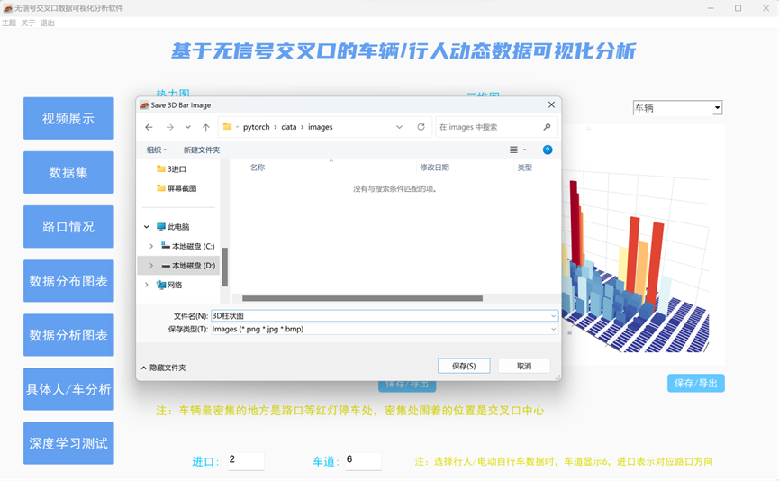 
（命名并保存为图片）
 
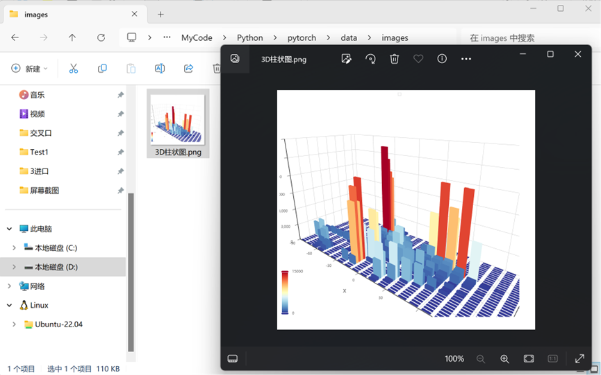
（成功导出图片展示）